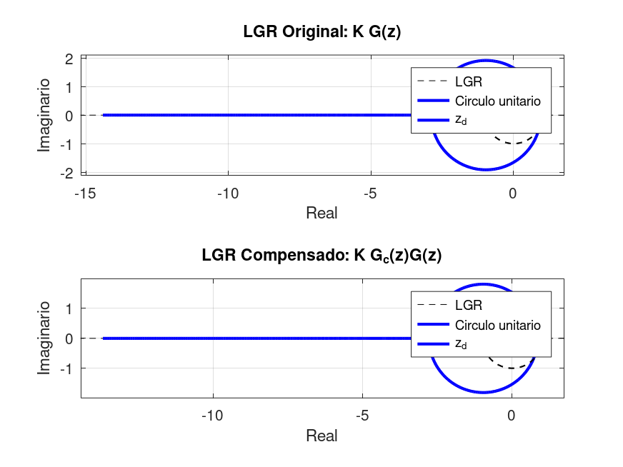
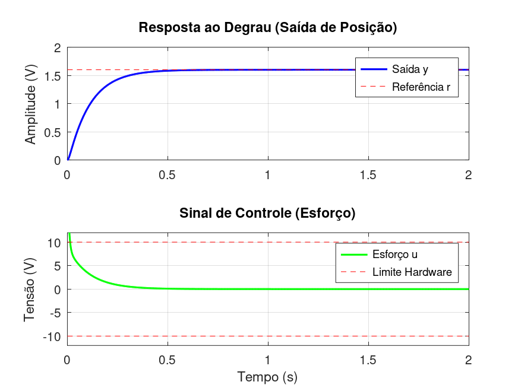
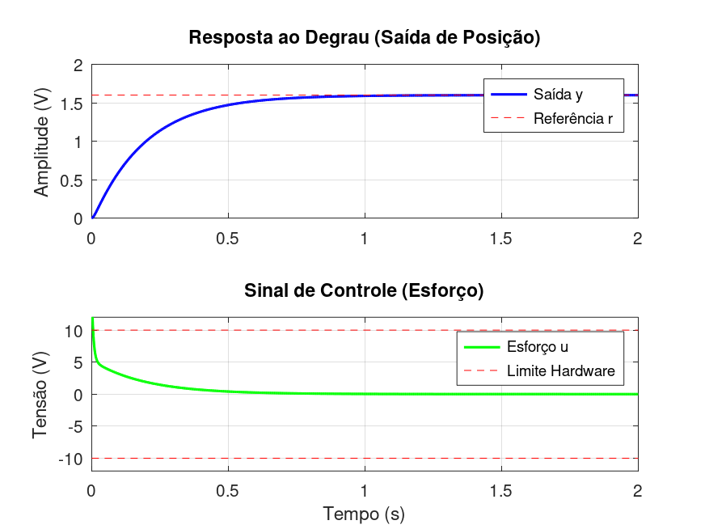
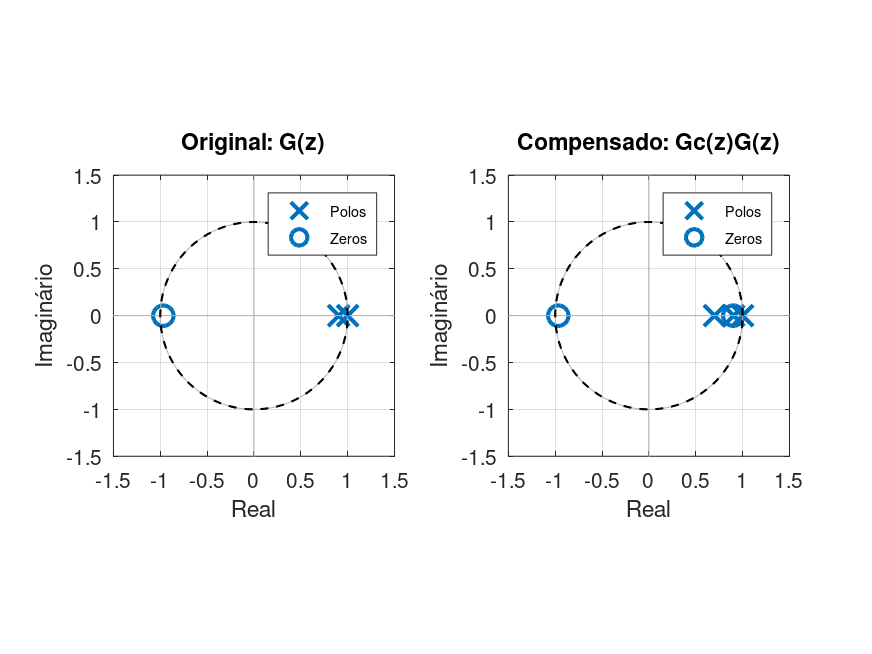
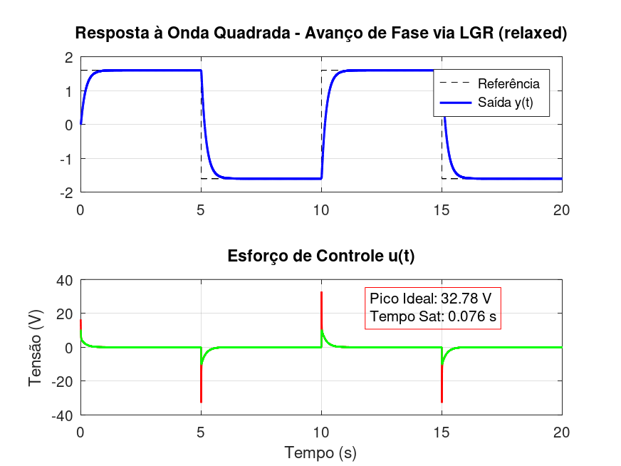
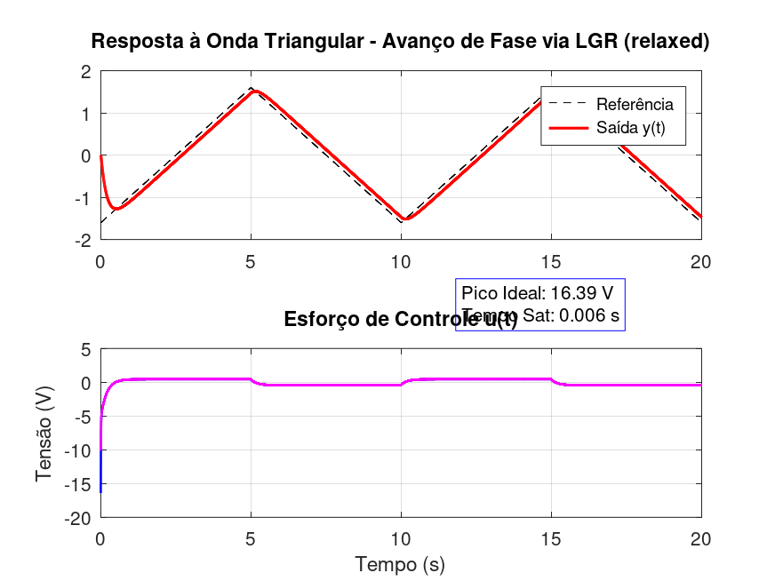

# Lead Compensator Design Report

**Generated**: 2026-04-05 17:56:35 | **Status**: INFEASIBLE (Relaxed Mode)

---

## System Configuration

| Parameter | Value |
|-----------|-------|
| K_plant | 1.438800 |
| τ_plant | 0.021200 s |
| T_sample | 0.002120 s |
| OutSat | 10.0 V |

## MODE 1: STRICT (Mp ≤ 4%, tp ≤ 0.50 s)

### Design Result

| Parameter | Value | Status |
|-----------|-------|--------|
| z_c | 0.900000 | ✓ |
| p_c | 0.700000 | ✓ |
| K_c | 17.805221 | ✓ |
| **Feasibility** | **INFEASIBLE** | ❌ |

### Performance Metrics (Strict)

| Metric | Target | Achieved | Status |
|--------|--------|----------|--------|
| Mp | ≤ 4% | 0.00% | ✓ |
| tp | ≤ 0.50s | 3.000s | ❌ |
| u_max_step | ≤ 9.0V | 17.81V | ❌ |
| u_max_sq | ≤ 11.0V | 56.98V | ❌ |
| t_sat_sq | ≤ 0.05s | 0.206s | ❌ |

### Feasibility Gate Diagnostics (Strict)

| Gate | Threshold | Rejections |
|------|-----------|------------|
| u_max_step | ≤ 9.0V | 0 |
| u_max_sq | ≤ 11.0V | 0 |
| u_max_tri | ≤ 11.0V | 0 |
| t_sat_sq | ≤ 0.05s | 0 |
| t_sat_tri | ≤ 0.02s | 0 |

Screened candidates: 0 | Passed all gates: 0

### Root Locus Analysis (Strict)



### Step Response (Strict)



---

## MODE 2: RELAXED (Mp ≤ 8%, tp ≤ 0.80 s)

### Design Result

| Parameter | Value | Status |
|-----------|-------|--------|
| z_c | 0.900000 | ✓ |
| p_c | 0.700000 | ✓ |
| K_c | 10.242930 | ✓ |
| **Feasibility** | **INFEASIBLE** | ❌ |

### Performance Metrics (Relaxed)

| Metric | Target | Achieved | Status |
|--------|--------|----------|--------|
| Mp | ≤ 8% | 0.00% | ✓ |
| tp | ≤ 0.80s | 3.199s | ❌ |
| u_max_step | ≤ 9.0V | 10.24V | ❌ |
| u_max_sq | ≤ 11.0V | 32.78V | ❌ |
| t_sat_sq | ≤ 0.05s | 0.076s | ❌ |

### Feasibility Gate Diagnostics (Relaxed)

| Gate | Threshold | Rejections |
|------|-----------|------------|
| u_max_step | ≤ 9.0V | 0 |
| u_max_sq | ≤ 11.0V | 0 |
| u_max_tri | ≤ 11.0V | 0 |
| t_sat_sq | ≤ 0.05s | 0 |
| t_sat_tri | ≤ 0.02s | 0 |

Screened candidates: 0 | Passed all gates: 0

### Root Locus Analysis (Relaxed)


### Step Response (Relaxed)



### Pole-Zero Map



### Square Wave Response



### Triangle Wave Response



---

## COMPARISON & DECISION

| Aspect | Strict | Relaxed |
|--------|--------|----------|
| Feasibility | ❌ NO | ❌ NO |
| Mp (achieved) | 0.00% | 0.00% |
| Peak effort (V) | 56.98 | 32.78 |

**✨ SELECTED**: Relaxed Mode

Strict mode infeasible due to feasibility gate violations.
Using relaxed baseline for controller comparison.

---

## Embedded Implementation (Next Step)

```yaml
Kc: 10.242930
z_c: 0.900000
p_c: 0.700000
b0: 10.242930
b1: -9.218637
a1: -0.700000
```

Run: `python deploy_yaml_generator.py 10.242930 0.700000 0.900000`

---

_Report generated by: `generate_design_report.m`_
_Timestamp: 2026-04-05 17:56:35_
