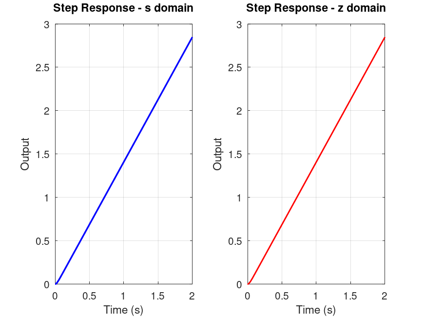
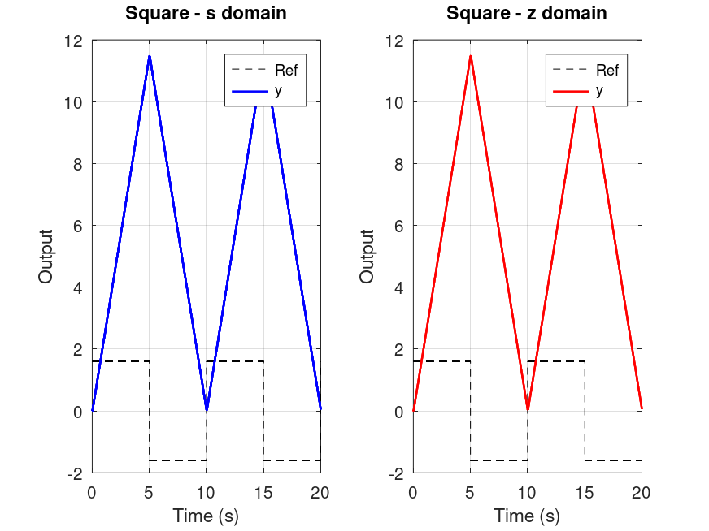
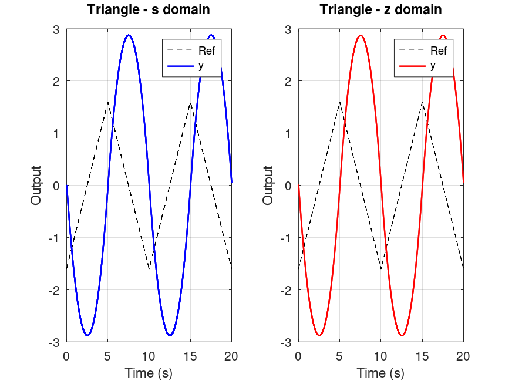
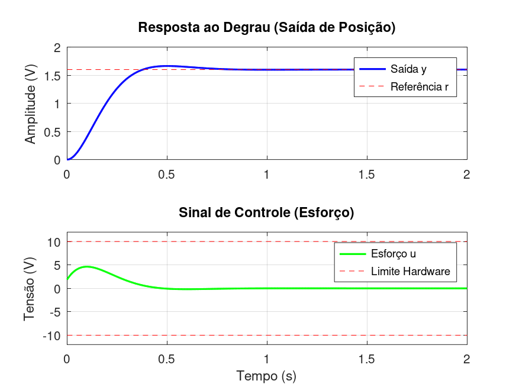
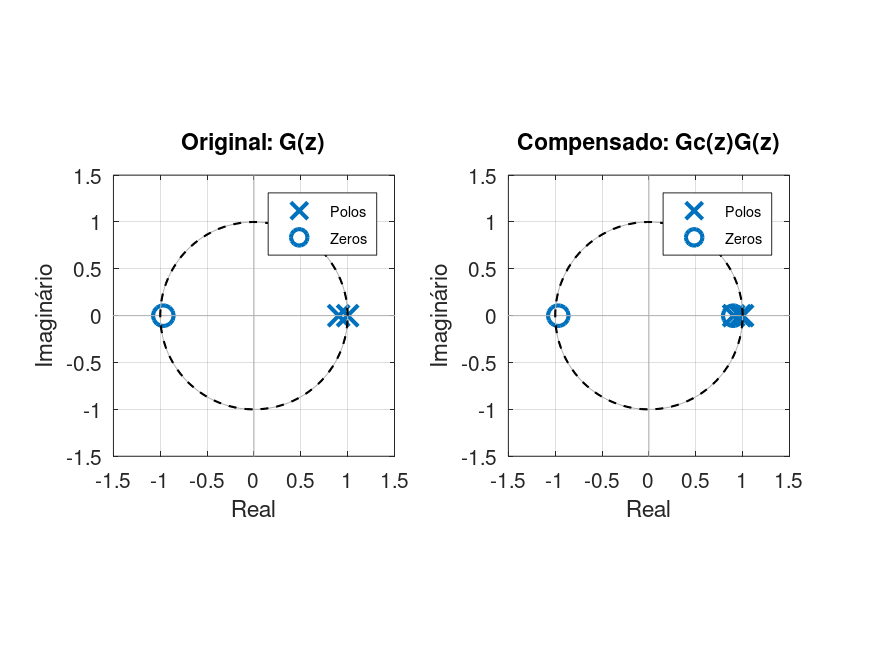
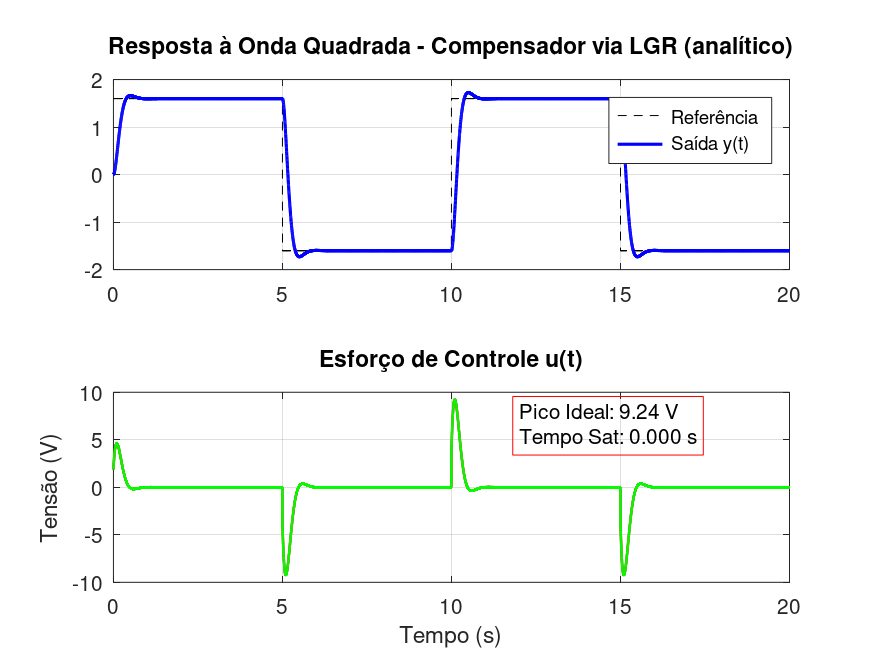

# Lead Compensator Design Report

**Generated**: 2026-04-05 20:26:55 | **Status**: INFEASIBLE | **Mode**: Analytic LGR

---

## Uncompensated System Analysis

The following responses compare the plant before compensation in the continuous-time domain (s) and the discrete-time domain (z).

### Step Response



### Square Wave Response



### Triangle Wave Response



---

## System Configuration

| Parameter | Value |
|-----------|-------|
| K_plant | 1.438800 |
| tau_plant | 0.021200 s |
| T_sample | 0.002120 s |
| OutSat | 10.0 V |

## Design Result

| Parameter | Value | Status |
|-----------|-------|--------|
| z_c | 0.900000 | ✓ |
| p_c | 0.972657 | ✓ |
| K_c | 1.179055 | ✓ |
| Structure | lag-like | WARN |
| Feasibility | INFEASIBLE | FAIL |

## Performance Metrics

| Metric | Target | Achieved | Status |
|--------|--------|----------|--------|
| Mp | <= 4% | 3.99% | OK |
| tp | <= 0.50s | 0.500s | FAIL |
| u_max_step | <= 9.0V | 2.89V | OK |
| u_max_sq | <= 11.0V | 9.24V | OK |
| u_max_tri | <= 11.0V | 4.48V | OK |
| t_sat_sq | <= 0.05s | 0.000s | OK |
| t_sat_tri | <= 0.02s | 0.000s | OK |

## Feasibility Gate Diagnostics

| Gate | Threshold | Rejections |
|------|-----------|------------|
| u_max_step | <= 9.0V | 0 |
| u_max_sq | <= 11.0V | 0 |
| u_max_tri | <= 11.0V | 0 |
| t_sat_sq | <= 0.05s | 0 |
| t_sat_tri | <= 0.02s | 0 |

## Root Locus Analysis


### LGR Numerical Analysis

| Scenario | Phase Error (deg) | K* real | K* imag | On Locus |
|----------|-------------------|---------|---------|----------|
| Original | 35.15 | 4.4361 | -3.1238 | NO |
| Compensated | 0.00 | 1.0000 | -0.0000 | YES |

Diagnosis: Compensation made z_d reachable by root locus.

## Step Response



## Pole-Zero Map



## Square Wave Response



## Triangle Wave Response


---

## Embedded Implementation

```yaml
Kc: 1.179055
z_c: 0.900000
p_c: 0.972657
b0: 1.179055
b1: -1.061150
a1: -0.972657
```

Run: `python deploy_yaml_generator.py 1.179055 0.972657 0.900000`

---

_Report generated by: `generate_design_report.m`_
_Timestamp: 2026-04-05 20:26:55_
